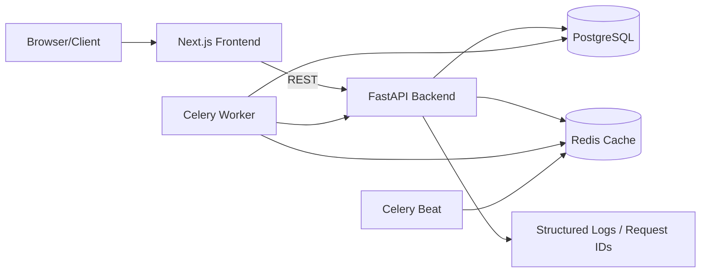

# Custom Scheme Screener

Production-grade custom scheme and stock screener for Indian markets (NSE/BSE), built with FastAPI + Next.js + PostgreSQL + Celery/Redis.

## 1) High-level architecture diagram



## 2) Folder structure

```text
.
├── backend/
│   ├── app/
│   │   ├── api/v1/          # REST endpoints
│   │   ├── core/            # config, db, security, logging, celery
│   │   ├── models/          # SQLAlchemy ORM models
│   │   ├── schemas/         # Pydantic request/response contracts
│   │   ├── services/        # screeners and ingestion services
│   │   └── tasks/           # Celery tasks
│   ├── alembic/             # migrations
│   ├── scripts/             # seed scripts
│   └── tests/               # backend tests
├── frontend/
│   ├── src/app/             # Next.js app router pages
│   ├── src/components/      # reusable UI components
│   └── src/lib/             # typed API helpers
├── docker-compose.yml
└── .github/workflows/ci.yml
```

## 3) Phased implementation plan

### Phase 1 — Foundation
- Scaffold backend + frontend projects.
- Configure env management, logging, health checks, and base docker-compose stack.
- Set up DB models and migration baseline.

### Phase 2 — Data & APIs
- Implement market/scheme ingestion services with provider abstraction.
- Add stock/scheme screener APIs, caching, CSV export, and pagination.
- Add job history and admin data quality APIs.

### Phase 3 — Strategy & Auth
- Implement JWT auth with role enforcement.
- Add strategy CRUD and execute endpoints.
- Add audit logging for admin actions.

### Phase 4 — UI Experience
- Build modern dashboard with live ticker, market cards, animation, and charts.
- Implement screener, compare, strategy, and admin/jobs pages.
- Ensure responsive and accessible UX.

### Phase 5 — Hardening
- Add tests, CI workflow, seed scripts, and docs.
- Validate lint/test/build paths for backend and frontend.
- Finalize production-ready docker setup.

## Boot up instructions

`<project-root>` below means your local clone root for this repository.

### Option A: one-command startup with Docker (recommended)

```bash
cd <project-root>
docker compose up --build
```

Services:
- Frontend: http://localhost:3000
- Backend API/OpenAPI: http://localhost:8000/docs

Stop everything:

```bash
cd <project-root>
docker compose down
```

### Option B: local development startup

Prerequisites:
- Python 3.11+
- Node.js 20+
- Docker (only for local Postgres + Redis)

1) Start database + Redis:

```bash
cd <project-root>
docker compose up -d db redis
```

2) Configure backend env for local hostnames:

```bash
cd <project-root>/backend
cp .env.example .env
```

Edit `<project-root>/backend/.env` and ensure these values:
- `DATABASE_URL` format is `postgresql+psycopg://DB_USER:DB_PASSWORD` + `@localhost:5432/screener`
- `REDIS_URL=redis://localhost:6379/0`

If you started Postgres with Docker Compose in step 1, the default credentials are `DB_USER=postgres` and `DB_PASSWORD=postgres`.
These defaults are for local development only and should never be used in production.
You can keep the rest of the values from `.env.example` as-is for local development.

3) Start backend API:

```bash
cd <project-root>/backend
python -m venv .venv
source .venv/bin/activate
pip install -r requirements.txt
alembic upgrade head
python scripts/seed.py
uvicorn app.main:app --reload --port 8000
```

4) (Optional) Run Celery worker + beat in separate terminals:

```bash
cd <project-root>/backend
source .venv/bin/activate
celery -A app.core.celery_app.celery_app worker -l INFO
```

```bash
cd <project-root>/backend
source .venv/bin/activate
celery -A app.core.celery_app.celery_app beat -l INFO
```

5) Start frontend:

```bash
cd <project-root>/frontend
npm install
npm run dev
```

## API coverage
- `GET /api/v1/market/snapshots`
- `GET /api/v1/market/ticker`
- `GET /api/v1/stocks` + `GET /api/v1/stocks/export`
- `GET /api/v1/schemes`
- `POST /api/v1/strategies`, `GET /api/v1/strategies`, `POST /api/v1/strategies/{id}/execute`
- `GET /api/v1/jobs/history`
- `POST /api/v1/admin/run-import`, `GET /api/v1/admin/data-quality`

## Default seed account
- Email: `admin@screener.local`
- Password: `admin123`

## Notes
- Data providers are abstracted in `backend/app/services/provider.py` with one concrete `MFToolSchemeProvider` and one `MockMarketProvider`.
- All endpoints are strict typed contracts with Pydantic schemas.
- Background jobs are idempotent upserts and retry-safe with Celery retries + exponential backoff.
